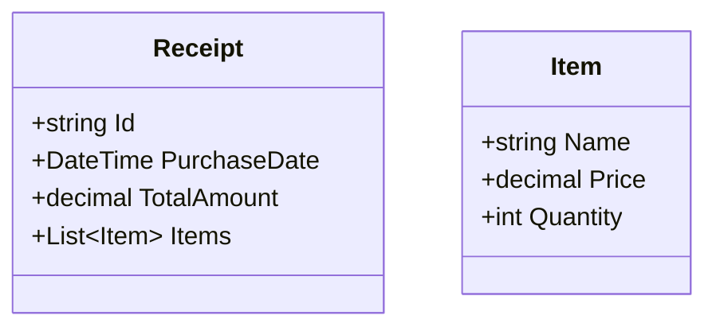

# Task: Fix Documentation Issue

## Problem Description
The Analytics project lacks comprehensive documentation, making it difficult for new developers to understand the system architecture and implementation details.

## Current Issues

### 1. Missing Architecture Documentation
- No high-level architecture diagrams
- No sequence diagrams for key workflows
- No data flow documentation

### 2. Incomplete Code Documentation
- Missing XML comments on public methods
- No documentation for configuration options
- No explanation of design decisions

### 3. Missing Setup Instructions
- No clear instructions for local development setup
- No Docker setup guide
- No database initialization guide

## Solution Steps

### Step 1: Create Architecture Documentation
Create architecture overview:
```markdown
# Analytics Service Architecture

## Overview
The Analytics service provides receipt analytics by migrating data from MongoDB to PostgreSQL and providing a REST API for querying.

## Components

### 1. Migration Service
- **Purpose**: Migrate receipts from MongoDB to normalized PostgreSQL schema
- **Schedule**: Runs on startup or via cron job
- **Dependencies**:
  - MongoDB (source)
  - PostgreSQL (target)

### 2. API Service
- **Purpose**: Provide REST API for querying analytics data
- **Endpoints**:
  - `/api/receipts` - Get receipts with filters
  - `/api/analytics` - Get aggregated statistics
  - `/api/health` - Health check endpoint

### 3. Database Schema

```

### Step 2: Add Code Documentation
Add XML comments to all public methods:
```csharp
/// <summary>
/// Synchronizes receipts from MongoDB to PostgreSQL.
/// </summary>
/// <param name="cancellationToken">The cancellation token.</param>
/// <returns>A task representing the asynchronous operation.</returns>
public async Task SynchronizeAsync(CancellationToken cancellationToken)
{
    // Implementation
}
```

### Step 3: Create Setup Instructions
Create comprehensive setup guide:
```markdown
# Local Development Setup

## Prerequisites
- .NET 8 SDK
- Docker (for databases)
- MongoDB compass (optional, for debugging)
- pgAdmin (optional, for PostgreSQL debugging)

## Quick Start

### 1. Clone the repository
```bash
git clone https://github.com/your/repo.git
cd repo/Analytics
```

### 2. Set up environment files
Copy `.env.example` to `.env` and update values:
```bash
cp .env.example .env
# Edit .env with your local settings
```

### 3. Start databases
```bash
docker-compose -f docker-compose.dev.yml up -d
```

### 4. Run migrations
```bash
cd src/ReceiptCollector.Analytics.Migrations
dotnet run
```

### 5. Start API
```bash
cd ../ReceiptCollector.Analytics.Api
dotnet run
```

## Configuration Options

### MongoDB Connection
- `MongoReceiptSource:ConnectionString` - MongoDB connection string
- `MongoReceiptSource:DatabaseName` - Database name (default: "receipt-data")

### PostgreSQL Connection
- `Postgres:ConnectionString` - PostgreSQL connection string
- `Postgres:DatabaseName` - Database name (default: "analytics")
```

### Step 4: Add Troubleshooting Guide
Create troubleshooting documentation:
```markdown
# Troubleshooting

## Common Issues

### Migration Fails with Connection Error
**Symptoms**: 
```
Npgsql.NpgsqlException: Exception while connecting to PostgreSQL server
```

**Solutions**:
1. Verify PostgreSQL container is running:
   ```bash
docker ps | grep postgres
```
2. Check connection string in `.env` file
3. Verify database exists (should be created automatically)
4. Check firewall settings if using local PostgreSQL

### API Returns 500 Error
**Symptoms**: 
API endpoint returns internal server error

**Solutions**:
1. Check application logs:
   ```bash
cd src/ReceiptCollector.Analytics.Api
dotnet run --verbosity normal
```
2. Verify migrations have been applied
3. Check database connection health
4. Review exception details in logs
```

## Files to Create
- `ARCHITECTURE.md` - Architecture documentation
- `SETUP.md` - Setup instructions
- `TROUBLESHOOTING.md` - Troubleshooting guide
- XML comments in all source files

## Testing Strategy
1. Review documentation for accuracy
2. Test setup instructions step-by-step
3. Verify troubleshooting solutions work
4. Get feedback from team members
